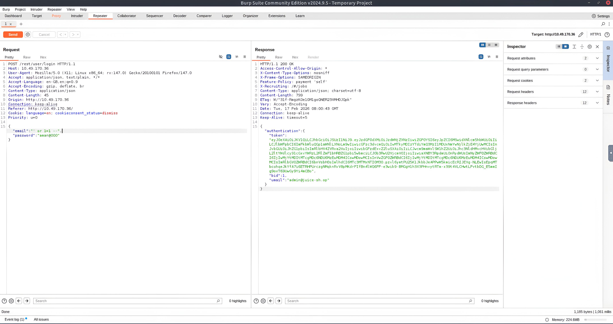

# Web Application Security Assessment Lab

## 📄 Project Overview
This project involves a black-box security assessment of a modern web application (**OWASP Juice Shop**). The goal was to identify and exploit critical vulnerabilities from the **OWASP Top 10**, focusing on Broken Authentication and Cross-Site Scripting (XSS).

### 🎯 Objective
To demonstrate practical proficiency in:
- **Burp Suite Professional/Community:** Intercepting and manipulating HTTP traffic.
- **SQL Injection (SQLi):** Bypassing authentication mechanisms.
- **Cross-Site Scripting (XSS):** Executing client-side code.

---

## 🛠️ Tools Used
- **Proxy:** Burp Suite (Repeater, Proxy)
- **Target:** OWASP Juice Shop (Virtual Machine)
- **Browser:** Firefox (FoxyProxy)

---

## 📸 Exploitation Walkthrough

### 1. Authentication Bypass (SQL Injection)
**Vulnerability:** The login endpoint failed to sanitize user input in the `email` field.
**Payload:** `' or 1=1 --`
**Methodology:**
1. Intercepted the login request using **Burp Suite Proxy**.
2. Sent the request to **Repeater**.
3. Injected the SQL payload into the JSON body to force a "True" condition.
4. The server responded with the Administrator's session token and user details.

*(Figure 1: Burp Suite Repeater showing the payload and the successful Admin response)*

### 2. Reflected Cross-Site Scripting (XSS)
**Vulnerability:** The search function reflected user input into the DOM without proper encoding.
**Payload:** `<iframe src="javascript:alert('xss')">`
**Methodology:**
1. Identified a search parameter reflected in the URL and page content.
2. Injected a JavaScript payload to test for execution.
3. The application executed the script, popping an alert box. This confirms the risk of session hijacking via malicious links.

*(Figure 2: Successful execution of the XSS payload in the browser)*

---

## 🛡️ Remediation Recommendations
To mitigate these risks, the following fixes are recommended:
1.  **Prevent SQLi:** Use **Parameterized Queries (Prepared Statements)** for all database inputs. Never concatenate strings directly into queries.
2.  **Prevent XSS:** Implement **Context-Aware Encoding** on all user input before rendering it in the browser. Use Content Security Policy (CSP) headers.
